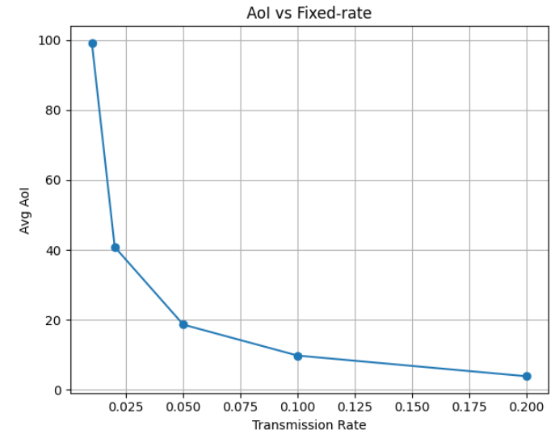
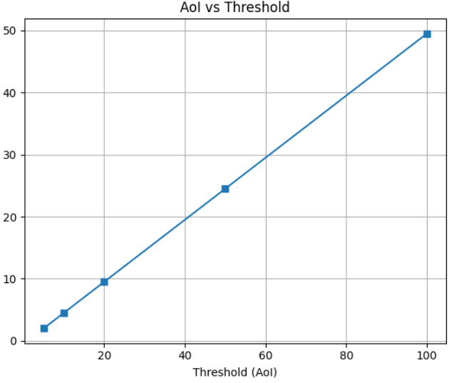
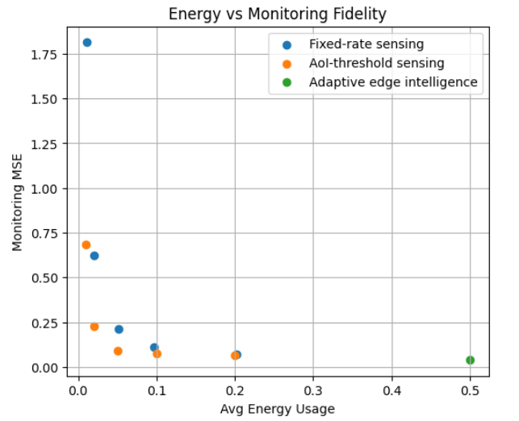
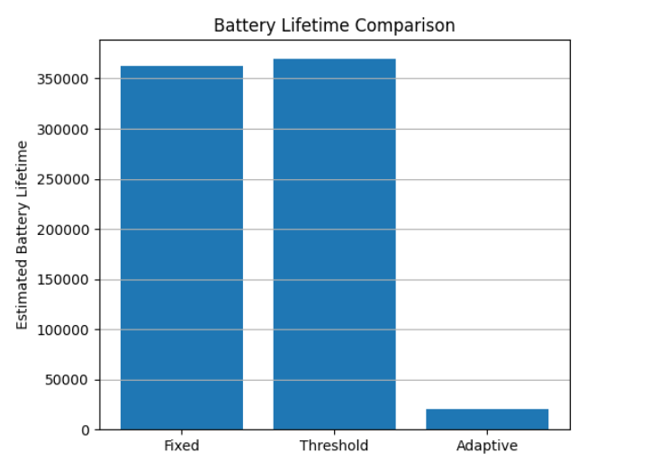

#  SmartPulse-AI  
**Adaptive Edge AI for Low-Power IoT Monitoring**

SmartPulse-AI is an intelligent IoT sensing framework that dynamically optimizes when sensors should transmit data. By leveraging **Reinforcement Learning (RL)** and **Age of Information (AoI)**, the system maintains accurate continuous monitoring while significantly reducing energy consumption.

##  Overview

Traditional IoT sensors transmit periodically, which leads to:

-  unnecessary battery drain  
-  redundant network traffic  
-  inefficient monitoring  

SmartPulse-AI introduces **adaptive edge intelligence** that learns optimal transmission policies to balance:

- Information freshness (AoI)  
- Energy usage  
- Monitoring fidelity  

##  Problem Statement

Battery-powered IoT devices often waste energy by sending updates even when the monitored signal changes slowly.

**Goal:**  
> Maintain accurate real-time monitoring while minimizing transmission energy.

##  Proposed Solution

We implement three sensing strategies:

1. **Fixed-rate sensing** (baseline)  
2. **AoI-threshold sensing**  
3. **Adaptive Edge Intelligence (Q-learning)** ←  Proposed method  

The RL agent learns when to transmit based on system state, enabling smart energy-aware sensing.

##  System Workflow
Sensor → Edge AI Decision → Transmission → Server Monitoring

Key principle:

> Transmit only when necessary.

##  Key Results

| Metric | Adaptive Policy |
|--------|----------------|
| Average AoI | **0.5** |
| Average Energy | **0.5** |
| Monitoring MSE | **0.039** |
| Estimated Battery Lifetime | **~20,000 units** |

 Maintains monitoring accuracy  
Reduces redundant transmissions  
Enables sustainable IoT operation  

##  Performance Visualizations
### AoI vs Fixed Rate

### AoI vs Threshold

### Energy vs Monitoring Fidelity

### Battery Lifetime Comparison

##  Methodology

The simulation models:

- Realistic temperature-like sensor signal  
- Transmission energy cost  
- Age of Information tracking  
- Q-learning based adaptive policy  
- Monitoring reconstruction at server  

##  Tech Stack

- Python  
- NumPy  
- Matplotlib  
- Reinforcement Learning (Q-learning)  
